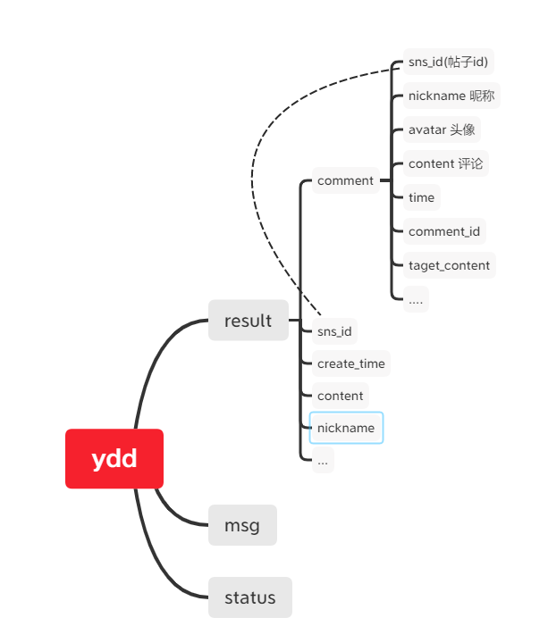
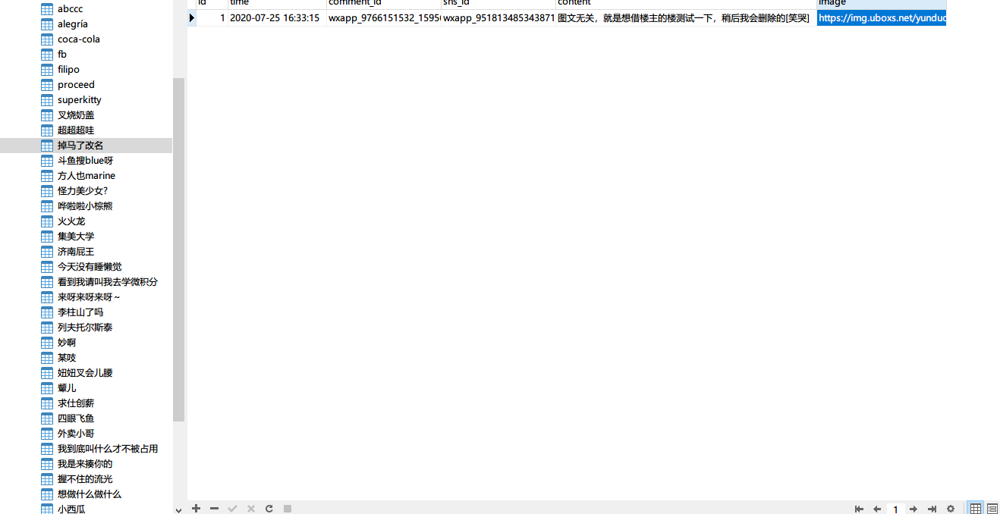
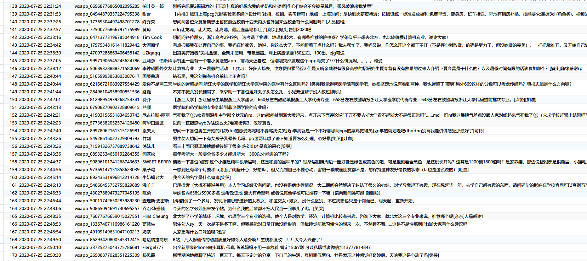
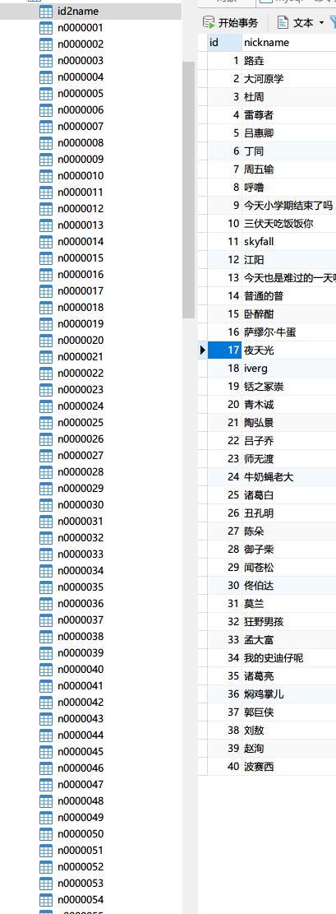
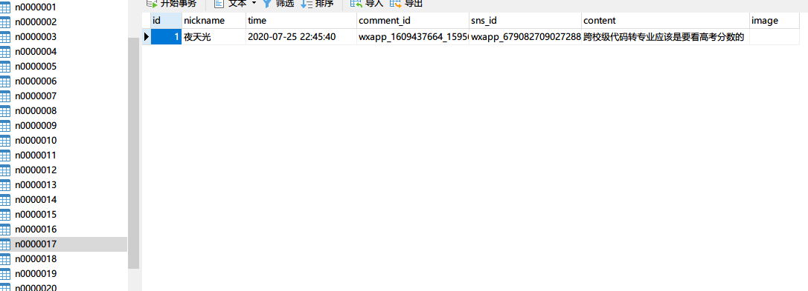

# YDD微信小程序爬虫
天天看论文跑实验脑壳疼，无心磕盐换个口味玩玩：Python爬虫ydd微信小程序，获取你所关心（滑稽）的人帖子和评论, 储存到数据库中, 以弥补ydd无法按用户名搜索内容的功能

## 实现思路
1. 使用抓包工具获取session和token.（安卓用户需要root。虽然笔者之前就拥有了root权限，但是为了将证书放入系统目录，仍花了一下午时间踩了无数个坑）
2. 查看网络返回json结构：\
  \
因此根据上图可以建立两个表：
   * 用户发帖表，包含的键有帖子id，用户昵称，时间戳等。
   * 用户评论表，每一个用户建立一个表，表名为递增的id号，键值包括评论id，内容，时间戳等，同时建立一个索引表，将id号和昵称一一对应，可以有效的避免某些用户名出现特殊字符导致无法建表的情况。
   （笔者只是略懂数据集知识，因此建库和建表比较暴力，没有考虑优化关系，同时为了处理某些用户的特殊字符或emoji表情，又踩了n个坑）起初设想为：
      

3. 一些逻辑，防止重复添加用户帖子或评论。（其中包含很多查询和循环，随着数据库的增大，速率会变低很多。数据库知识储备不足，不lan会de优化）
4. 效果展示：
    * 用户发帖表
      
     
    * 用户评论表
       
       

## How to run
1. Environment:
   * Python >= 3
   * MySQL >= 8
2. Change your session seed and token located in `lines 115 121 122` in `spider.py`, and `Line 124 125` is your database connection.
3. Now, have fun!

## Todo
1. 未剔除匿名用户帖子和评论，可以通过头像粗略剔除，可能会误删。（要好好科研了，留着以后心情好了填坑）
2. 。。。
